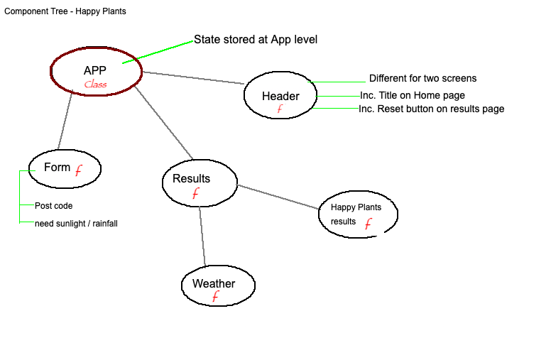

# Notes

**First Form**

INPUT:

- postcode
- options: Do your plants... need sunlight / rainfall

**Results**
Options:

- time selection: today / tomorrow / the day after

OUTPUT:

- Weather for today / tomorrow / the day after
- Happy Plants score

---

### Calculating how happy plants will be

**Need sunlight:**

- More than 5 hours of sunlight: +10
- More than 3 hours of sunlight: +5
- No sunlight today: -5 (display message: "Hopefully some good weather comes soon!")

**Need rainfall:**

- Heavy rain: +10
- some rain: +5
- No rain today: -5 (display message: "Make sure to water your plants!")

---

### Pages

Mobile first design, responsive, clear & easy to use

**Home Screen**

- Title
- Subtitle
- Postcode input
- Need sunlight / rainfall options
- Submit button

**Results Screen**

- Weather breakdown
- Happy plants results
- Reset button (Return to home screen)

---

### Component Tree

